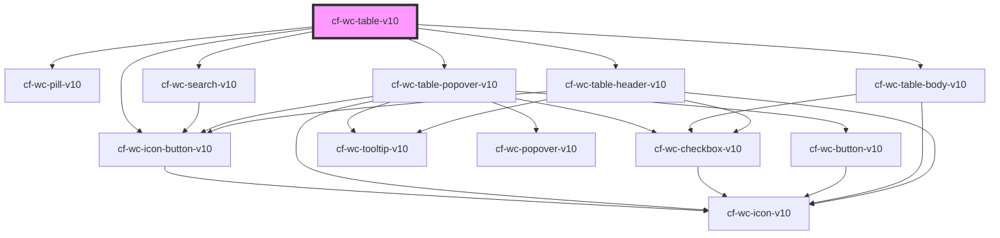

## Architecture

The table is a component which can render fully custom row components multiple times, manage their lifecycles in a
virtual scrolling viewport. It frequently makes recommendations to user-specified components via props and CSS variables
to maintain visual consistency, so it is naturally a bit more complex than components with basic slots. This document
will help you understand how to create a custom component, and that template's responsibilities

### Markup Responsibility

Each table has very different rows, but the difference between each row within the same table is usually quite
small. Because of this, the table uses multiple layers of web components to ensure maximum customizability while saving
you as much work as possible. Please see [Table Areas](#table-areas) at the bottom of the page for more information.

The general format of the table looks a bit like this:

```html
<cf-wc-table-v10>
  #shadow-root
  <internal-markup-and-shadow-doms>
    <your-row-component data="{...}" index="{...}" style="--...: ..."> </your-row-component>
  </internal-markup-and-shadow-doms>
  <div slot="header">Your slot components</div>
</cf-wc-table-v10>
```

Your row component and the table must correctly communicate to leverage each of the table's features, as discussed below
in Your Row Component.

### State Management

This table follows the priciples of application architecture established in the [Frontend Training Guide](https://chatham.tech/frontend/training-guide/application-architecture/#the-root-of-all-evil-tldr),
and therefore only remembers the absolute bare minimum needed to function. Almost everything is derived from your
application's state, which is passed through props. User interaction with the table triggers events which recommend
making state transitions in your application, but your application can ignore those recommendations.

There are a few pieces of mutable state in the table:

- A copy of `columns` in the popover, which stores changes from the user before they are applied or discarded.
- The key of the element being dragged and dropped, and its position, in the header, body, and popover
- The key of the column currently being resized in the header

In addition, the table stores some pseudo-derived state which would be inconvenient or unperformant to recompute:

- Row offsets and metadata in the table body, required to scroll at high framerates
- The scrollTop, scrollLeft, height, and width of the virtual scroll viewport and popover list
- Various element refs from which scrollTop, scrollLeft, heights, and widths are derived

Every other facet of the table is controlled solely by its props. If the table has gotten itself into a bad state,
there's a pretty good chance your reducers are what got it into that state.

### Writing State Transitions

Because the table requires some participation from your application to ensure that your application contains the source
of truth, it is important to know how to write state transitions for each event. Some of the more complex state
transitions arise from events with multiple changes to the data, such as the `columnVisibilityChanged` event. These
state transitions can usually be handled with `reduce` and `assoc`-like functions, as shown below.

```typescript
import * as R from 'ramda';

function nextColumnsForColumnVisibilityChanged(currentColumns, change) {
  return change.reduce((acc, { column, visibility }) => {
    return R.assocPath([column, 'visibility'], visibility, acc);
  }, currentColumns);
}
```

## Describing Each Column

```typescript
export type TableColumn = {
  /// Stuff to which table doesn't propose changes, but the user is allowed to change
  // The displayed name of the column
  readonly name: string;
  // Whether the column's text is aligned to the right or left
  readonly align: 'left' | 'center' | 'right';
  // Whether the column is sticky, and if so, to what side it should stick.
  readonly sticky?: 'left' | 'right';
  // Whether this column can be reordered. Undefined is equivalent to true.
  readonly reorderable?: boolean;
  // The name of an icon to display next to the name of the header.
  // If `tooltip` is specified, display a tooltip with the specified. text.
  readonly icon?: { readonly name: string; readonly tooltip?: string };
  // A method of sorting this column.
  readonly sorter?: Sorter;
  // The name of a custom element to render under the row's label and
  // icons. Typically used for searching and filtering specific columns.
  readonly slot?: string;
  // A method of searching the table. Intended for use with a slot
  readonly searcher?: Searcher<unknown>;
  // A query by which this table is to be searched. Intended for use with a slot
  readonly query: unknown;

  /// Stuff to which table does propose changes
  // The direction and arity with which this column is being sorted.
  readonly sorting?: Sorting;
  // The order in which this column is displayed. Larger numbers go further to the right.
  readonly displayOrder: number;
  // The width of this column in pixels
  readonly width: number;
  // Whether this column is not currently displayed in the table. Undefined means false.
  readonly hidden?: boolean;
  // Whether this column's visibility can be changed by the user. Undefined means false.
  readonly lockVisibility?: boolean;
};
```

Putting it all together, a valid example of `columns` can be seen below:

```typescript
{
    year: {
        name: "Release Year",
        displayOrder: 3,
        width: 150,
        align: 'left',
        icon: {name: 'calendar'},
        sorter: {mapping: (row: any) => row.year},
    },
}
```
Note that the example above, although having a `sorter` in place, does not actually execute the sort unless its `sorting` property is specified.

## Your Row Component

To render a table row, you must register the component that is to be your row as a Custom Element. Details on how to do
this vary by framework, but creating and registering a Custom Element in Vanilla TS looks like this:

```typescript
class MyTableRow extends HTMLElement { ... }

if(!customElements.get('my-table-row')) {
    customElements.define('my-table-row', MyTableRow);
}
```

In Angular, you can do this:

```typescript
import { createCustomElement } from '@angular/elements';

// Remove the `bootstrap` entry from your @NgModule declaration and add CUSTOM_ELEMENTS_SCHEMA
export class AppModule {
  constructor(private injector: Injector) {}
  ngDoBootstrap(app) {
    // Convert the Angular component into a custom element and add it to the Custom Element Registry
    const customEl = createCustomElement(TableRowComponent, {
      injector: this.injector,
    });
    customElements.define('my-table-row', customEl);
    // Manually bootstrap the app (because we removed the automatic bootstrapping entry)
    app.bootstrap(AppComponent);
    const el = document.createElement('app-root');
    document.body.appendChild(el);
  }
}
```

Angular makes everything more complicated, as always, so check [this repo](https://git.chathamfinancial.com/aniederer/wc-table-angular-elements-poc/-/tree/master)
for a (very rough) working example.

### Returning Row Metadata

Now, you must tell the table to render that element via its `getRowDetails` prop. `getRowDetails` is a function that takes an
element of your data array and the index at which it occurs in the table, and returns `element`, the name of the Custom
Element to render, the `height` of said custom element, and a `key` that is unique and unchanging for each piece of
data. Below is an example of a valid `getRowDetails` function:

```typescript
function getRowDetails(data, index) {
  return { element: 'my-table-row', height: 35, key: data.id };
}
```

Note that `key` does not need to take `index` into account; the table does that for you.

### Row Structure

The table provides a grid layout for your columns, based on the names of each column you pass in. For example, if you
pass in:

```typescript
"columns": {
   "name": {displayOrder: 0, width: 250},
   "start-date": {displayOrder: 1, width: 150},
}
```

The shadow host of your table's row will be styled with the following grid:

```css
grid-template-columns: 250px 150px;
grid-template-areas: 'name start-date';
```

You can then take advantage of this grid by setting your shadow root to `display: contents` and each column's
`grid-area` to its corresponding name, as such:

```html
<my-table-row>
  #shadow-root
  <div class="my-table-row" style="display: contents">
    <div class="my-table-cell-name" style="grid-area: startDate">35 Billionaire's Row</div>
    <div class="my-table-cell-start-date" style="grid-area: startDate">Jun 12 2025</div>
  </div>
</my-table-row>
```

Of course, if you wish to ignore the grid layout, such as when you wish to replace the entire row with a prompt or
a different type of element, you are also able to do so.

### Props & Styles

The table will instantiate the appropriate number of elements with the name and height specified in `getRowDetails`, and
pass it two props: `data` and `index`. `index` is the 0-indexed order in at which the row occurs in the table, and
`data` is the element of your data array which corresponds to the row.

The table will also set lots of CSS variables on your row, depending on the props you passed into the table. You are
technically able to ignore these variables, but it is **highly** recommended that you use them to set the styles in your
table row, to ensure your table meets the requirements set in the design guidelines.

```scss
@each $column in (name, start-date) {
  .my-table-cell-#{$column} {
    display: var(--wcpl-table-display-#{$column}, flex);
    position: var(--wcpl-table-position-#{$column}, unset);
    left: var(--wcpl-table-left-#{$column}, unset);
    right: var(--wcpl-table-right-#{$column}, unset);
    border-left: var(--wcpl-table-border-left-#{$column}, unset);
    border-right: var(--wcpl-table-border-right-#{$column}, unset);
    background: var(--wcpl-table-background, unset);
    height: var(--wcpl-table-height, unset);
    color: var(--wcpl-table-color, unset);
  }
}
```

### Events

Each row is rendered within the Shadow DOM of the table body, rather than as slotted elements. Because of this, your
table row component must fire [composed events](https://pm.dartus.fr/blog/a-complete-guide-on-shadow-dom-and-event-propagation),
so they bubble through the table's Shadow DOMs and up to your application code.

To do so, call `HTMLElement#dispatchEvent` on an HTMLElement within your row (not an Angular or React ref), passing a
`CustomEvent` with your event name, whatever detail you wish to send back up to the table, and `composed: true`.

```tsx
// In your row component
// ...
<cf-wc-button-v10 onClick={() => this.onClick()}></cf-wc-button-v10>
// ...

onClick() {
  const rootElement: HTMLElement = ...;
  rootElement.dispatchEvent(new CustomEvent('userDefinedEvent', {
    detail: this.data.name,
    composed: true,
  }))
}
```

Keep in mind that JavaScript events are not namespaced by default, so you should prepend some tag at the beginning to
separate your app event from whatever other custom events are being thrown. For example, if your app's components are
all named `<app-...>`, your events should look like `appSearched`.

## Sorting

To enable sorting for a column, you need to:

(1) Specify the column and the sort direction using the `sorting` property of the column object; AND

(2) Pass a `sorter` key inside that column's description. In the interest of
flexibility, you have the option to pass either a value of `{mapping: () => ...}` or `{comparator: () => ...}`.

```ts
export type Sorting = {
  readonly direction: SortDirection;
  readonly order: number;
}

export type Sorter =
  // A mapping from row to sortable data which represents this column; for use w/ default sorter
  | { readonly mapping: (row: unknown) => unknown }
  // An arbitrary comparator between two rows
  | { readonly comparator: (row1: unknown, row2: unknown) => ComparatorResult };
```

The former option should take an element of your data array and return a value that is then fed into the WCPL's default
comparator. The default comparator supports dates, strings, numbers, and arrays, and always puts null or empty values at the
bottom of the table.

The latter option requires you to provide your own comparator. This comparator takes two elements of your data array,
and returns a `ComparatorResult`. The `*-any` results allow you to sort certain rows regardless of sort direction,
and are used in the default comparator to always put null or empty values at the bottom of the table.

```typescript
export type ComparatorResult = 'r1-then-r2' | 'r2-then-r1' | 'dont-move' | 'r1-then-r2-any' | 'r2-then-r1-any';
```

## Searching

Much like sorting, there are two searching options: one for convenience and uniformity, and one for ultimate control. As
before, you can choose `mapping` to return a value which will be run through the default searcher, or `predicate` to
take the element of your data array and search query, and decide for yourself whether you want the column to be included
in the search results.

```typescript
export type Searcher<Q> =
  // A mapping from row to searchable data which represents this column; for use w/ default searcher
  | { readonly mapping: (row: unknown) => unknown }
  // An arbitrary search predicate for a given row and query. Currently required if ~(Q extends string)
  | { readonly predicate: (row: unknown, query: Q) => boolean };
```

The top-level `searcher` prop on the table corresponds to the behavior of the search box in the table header, and is of
type `Searcher<string>`, which uses the toplevel prop `query`. Any row which does not pass both the global searcher and
all specified column searchers will be excluded from the table body.

If the `searcher` prop is specified and `data` is not empty, the search input built into the header will display. To
search the table with an external search input, set `showSearch` to `false` and pass the modeled value of your external
search input into `query`.

### Per-Column Searching

You may also add a searcher to each column by specifying `columns.${col}.searcher` and `columns.${col}.slot`. `slot` is
the name of a custom element which may send up a composed event when it wishes to emit a search query. The CustomEvent's
name can be anything, but it should not be the same as something the table itself emits. You may then react to it on the
toplevel `cf-wc-table-v10` element like any other event.

```tsx
// In the custom element specified at columns.${col}.slot
<cf-wc-date-range-picker-v10
  onChanged={({detail}) => this.dispatchEvent(new CustomEvent('columnSearched', {
    detail: { column: this.columnKey, value: detail },
    composed: true,
  }))}>
</cf-wc-date-range-picker-v10>

// In the component which contains the table
<cf-wc-table-v10
  onColumnSearched={({detail: {column, value}}) => {
    setState(R.assocPath(['columns', column, 'query'], value))
  }}>
</cf-wc-table-v10>
```

The custom element will be passed four props:

- <code class="lang-ts">column: TableColumn</code> is the full column object; use this to access `query`.
- <code class="lang-ts">columnKey: string</code> is the key at which the column object is (i.e. the value of `${col}`)
- <code class="lang-ts">index: number</code> is the order in which the column appears. This is not `columns.${col}.displayOrder`.
- <code class="lang-ts">clone: boolean</code> is true if this column is a "cloned" element (blue border) which is
  currently being dragged

Note that two of the same custom element will be rendered while the user is reordering the column header via
drag-and-drop. If this causes problems, you can use `clone` to skip doing whatever is causing problems during the
dragging operation.

Unlike the table's search box, `columns.${col}.query` can be of any type, but you will need to use a `predicate`
searcher if it's not a string. If you have a good default searcher for a non-string type, consider contributing it.

Please note that **the per-column searchers recieve the same row object as the global table search**, so your column
searchers can use the content of other columns to determine whether something should be included in the search results.

## Pagination

The table uses highly-optimized virtual scrolling, so it is capable of displaying more data than most backends are
comfortable sending in one shot. To achieve the best user experience, the frontend application's backend should give the
frontend application the total number of rows in the first page of data.The frontend appication should then set
`row-count` to that total.

Then, to make the scrollbar work as if the table had all of the data available, the app should precalculate roughly how
tall it expects the table to be, and pass that number to `scrollable-height`. If the rows are not all of the same
height, extrapolating the average height of each row in the available pages should be close enough to not be jarring.

Finally the frontend application should react to scrolling, searching, and sorting events, as these will likey require
showing data from pages which have not yet loaded. The `scrolled` contains the row index at the top and bottom of the
viewport, so the frontend application should ask for more data from the backend when that number gets close to the
number of rows currently loaded.

The `searched` and `sorted` events, along with any CustomEvents sent by [per-column searchers](#per-column-searching),
will likely require either loading all remaining pages or doing the searching or sorting on the backend to provide a
good user expeirence. In the latter case, you may wish to set your `searcher`s to `{predicate: () => true}`
and `sorter`s to `{comparator: () => "dont-move"}` so as to preserve the searching and sorting elements, and respond to
the `searched` and `sorted` events by replacing `data` with the searched and sorted results from the backend.

## Exporting to Excel

The `export` function on the table element allows you to export table data to an Excel file.

```typescript
async function export(bundle: ExportBundle<any>, customizer: (workbook: Workbook) => Workbook = a => a);

type FormattedNumber = { value: number; fmt: string };
type FormattedDate = { value: Date; fmt: string };

type ExportBundle<T> = {
  /** The filename and title of the exported table */
  title: string;
  /** A long-form description of the table, displayed below the title */
  description?: string;
  /** Mappings from a row of data to a cell's value for a given column */
  mappers: Readonly<Record<string, (row: any, index: number) => string | number | FormattedNumber | FormattedDate>>;
  /** Optional data that overrides the corresponding values given to the table as props for the exported workbook */
  columns?: Readonly<Record<string, TableColumn>>;
  searcher?: Searcher;
  data?: readonly T[];
  getRowDetails?: RowDetailsFn<T>;
  query?: string | any;
};
```

`bundle` is an object containing some export-specific data, along with data which can be optionally provided to override
the values passed to the table. This allows you to, for example, have a full-export button, and a button which only
exports rows matching a specific predicate without having to filter it on the webpage as well.

`customizer` is a function which allows further processing of the raw ExcelJS workbook before it is finalized and
downloaded. It is passed an exceljs `Workbook` object and must return that same `Workbook`.

```tsx
// If you need access to ExcelJS types, `import type` prevents it from cluttering your js bundle.
import type { Workbook } from 'exceljs';
tableRef?.export(/* ... */, (workbook: Workbook): Workbook => {
  const worksheet = workbook.worksheets[0];
  const cellA1 = worksheet.getCell('A1').fill = {
    type: 'pattern',
    pattern: 'solid',
    fgColor: { argb: 'FFFF0000' }
  };
  return workbook;
});
```

To use this function, you must get a reference to the element using your framework, and call `export` on it, as in the
below usage examples. Note that all code pertaining to excel exporting, including ExcelJS, is loaded in a deferred
manner, so it will pull down about a megabyte of JavaScript when the function is invoked.

### React Usage Example

```tsx
const MyComponent = () => {
  const tableRef = useRef<CfWcTableV10>(null);
  return (
    <>
      <CfWcTableV10 ... ref={tableRef}></CfWcTableV10>
      <CfWcButtonV10 onTouched={async () => {
        await tableRef.current?.export({
          title: 'Table Data Export',
          description: 'Export of table data',
          mappers: {
            name: (row) => row.name,
            email: (row) => row.email,
          },
        });
      }}>Export Table</CfWcButtonV10>
    </>
  );
};
```

### Angular Usage Example

```tsx
@Component({
  selector: 'app-my-component',
  template: `
    <cf-wc-table-v10 ... #tableRef></cf-wc-table-v10>
    <cf-wc-button-v10 (touched)="handleExport()">Export Table</cf-wc-button-v10>
  `,
})
export class MyComponent {
  @ViewChild('tableRef', { static: false }) tableRef!: CfWcComponentV10;

  async handleExport(): Promise<void> {
    await this.tableRef.export({
      title: 'Table Data Export',
      description: 'Export of table data',
      mappers: {
        name: (row) => row.name,
        age: (row) => row.age,
        email: (row) => row.email,
      },
    });
  }
}
```

## Page-Attached Sticky Header

By default, the table's header sticks to the top of its scrolled viewport. When stickyHeader is true, the header instead
sticks to the lower of the top of the document body and the viewport, allowing users to see what each column represents
even as they scroll the page past the table's header. This, however, requires all elements inside headers' slots to be
reparented outside the header, as the header must create an overflow container for just itself to achieve this
behavior. Most WCPL elements will reparent their popups when their `reparent` property is set; consult each individual
element's documentation for more information.

## Hard Limitations

- Each column must be given a static width - you cannot use `fr`, `%`, or `auto` widths
  - You may use `column-refitting` to achieve a similar result to setting percentage widths
- Popups originating inside the table body cannot overflow the table body
- Each row's height must be synchronously computable, and cannot be dependent on the height of wrapped non-monospace text.

## Soft Limitations

- Grouping and aggregation should be implemented by the consuming app (add a "total/group header" row where desired)

## FAQ

### Why are my rows jittering when I stop scrolling vertically?

Your `getRowDetails` function is returning a `height` which does not match the actual rendered height of the row.

### Why is my cursor position desynchronizing with the column's edge when resizing?

Your `coulumnResized` reducer and the table's `render` function must complete in less than 32.33~ milliseconds (30FPS).

### Why are my rows getting corrupted when I search or sort?

Your `getRowDetails` function's `key` is probably not unique per each row.

### Why are lifecycle events (ngOnInit, connectedCallback) in my rows not being called?

### + Why is my table only re-displaying the first few rows when scrolled?

If you are using created/destroyed lifecycle hooks or component-level state, you need to set `reuse-row-elements` to
`false`. This has a negative effect on performance, so try to avoid using component state or those lifecycle hooks if
possible.

### Why are my table cells all stacked on top of one another?

You need to set `grid-area` in each cell. See Row Structure.

### Why are my table cells not horizontally aligned with the header cells?

You need to set a `width` for each column. Please make sure that you are passing a value for each non-nullable property
of TableColumn, as shown in Describing Each Column

### How do I add a loading spinner?

To add a spinner when loading data:

- While data is loading, set `data` to `[]` and use `<div slot="no-data" class="cf-loading"></div>`.
- If no data is loaded, replace `cf-loading` with your preferred error content.

To add a spinner when sortring/searching paginated data on the backend, do the above, then:

- Set `data` to `[]` while the operation is happening
- Set `data` to the result of the operation when it completes
- If no results are returned from a search operation, set `searcher` to `{predicate: () => false}`
- (Optional) Use `<div slot="no-search-results"></div>` to override the default message if desired

There may be improvements which make this less janky in the future; If you are
doing backend sorting and searching, please provide feedback.


# cf-wc-table-v10

<!-- Auto Generated Below -->


## Properties

| Property                | Attribute                 | Description                                                                                                                                                                                                             | Type                                                                                                                                                                                           | Default                                                                      |
| ----------------------- | ------------------------- | ----------------------------------------------------------------------------------------------------------------------------------------------------------------------------------------------------------------------- | ---------------------------------------------------------------------------------------------------------------------------------------------------------------------------------------------- | ---------------------------------------------------------------------------- |
| `alignPopover`          | `align-popover`           | Whether to place the popover to the left of, or right of, the searchbox                                                                                                                                                 | `"left" \| "right"`                                                                                                                                                                            | `'right'`                                                                    |
| `allowColumnReordering` | `allow-column-reordering` | Whether to allow columns to be dragged for reordering                                                                                                                                                                   | `boolean`                                                                                                                                                                                      | `true`                                                                       |
| `allowColumnResizing`   | `allow-column-resizing`   | Whether to allow column borders to be dragged for resizing                                                                                                                                                              | `boolean`                                                                                                                                                                                      | `true`                                                                       |
| `allowRowReordering`    | `allow-row-reordering`    | Whether to display grippers with which rows can be reordered                                                                                                                                                            | `boolean`                                                                                                                                                                                      | `true`                                                                       |
| `allowRowSelection`     | `allow-row-selection`     | Whether to display checkboxes with which rows can be selected, and the "select all" checkbox in the header                                                                                                              | `"all" \| "individual" \| "none"`                                                                                                                                                              | `'all'`                                                                      |
| `columnRefitting`       | `column-refitting`        | When to refit columns to the width of the table                                                                                                                                                                         | `"all" \| "initial" \| "none" \| "resize"`                                                                                                                                                     | `'none'`                                                                     |
| `columns`               | --                        | A description of each column in the table. See the documentation for more information.                                                                                                                                  | `{ readonly [x: string]: TableColumn; }`                                                                                                                                                       | `{}`                                                                         |
| `context`               | `context`                 | A value passed verbatim to all row elements containing any global context needed within the rows. Does not affect component behavior.                                                                                   | `any`                                                                                                                                                                                          | `undefined`                                                                  |
| `data`                  | --                        | The data with which the table is filled                                                                                                                                                                                 | `readonly Readonly<Record<string, unknown>>[]`                                                                                                                                                 | `[]`                                                                         |
| `delayRowRendering`     | `delay-row-rendering`     | Whether to render skeletons in place of rows until a user stops scrolling, to improve framerate while scrolling                                                                                                         | `boolean`                                                                                                                                                                                      | `false`                                                                      |
| `disabled`              | --                        | A set containing keys of each row considered to be disabled                                                                                                                                                             | `ReadonlySet<string \| number>`                                                                                                                                                                | `new Set()`                                                                  |
| `getRowDetails`         | --                        | A function called for each row which returns the `element` to render, its `height`, and a unique `key`                                                                                                                  | `(datum: Readonly<Record<string, unknown>>, index: number) => { readonly element: string; readonly key: string \| number; readonly height: number; readonly rowCount?: number \| undefined; }` | `(..._) => {     throw 'cf-wc-table-v10: please provide getRowDetails';   }` |
| `headerLook`            | `header-look`             | Whether the table should use the pattern library card style                                                                                                                                                             | `"card" \| "flat" \| "none"`                                                                                                                                                                   | `'card'`                                                                     |
| `headerSize`            | `header-size`             | <span style="color:red">**[DEPRECATED]**</span> This will be "large" by default and not configurable in v11. The height of the of the card header<br/><br/>                                                             | `"large" \| "small"`                                                                                                                                                                           | `'small'`                                                                    |
| `isExpanded`            | `is-expanded`             | Whether or not the table is expanded. Set to "hidden" to hide the expando button and keep the table expanded.                                                                                                           | `"false" \| "hidden" \| "true"`                                                                                                                                                                | `'true'`                                                                     |
| `lastColumnWidth`       | `last-column-width`       | Whether the last column should grow to match the width of the table                                                                                                                                                     | `"exact" \| "fill"`                                                                                                                                                                            | `'exact'`                                                                    |
| `look`                  | `look`                    | The overarching style of the table                                                                                                                                                                                      | `"card" \| "compact"`                                                                                                                                                                          | `'compact'`                                                                  |
| `popoverLook`           | `popover-look`            | The look of the table settings popover's activation button                                                                                                                                                              | `"outlined" \| "transparent"`                                                                                                                                                                  | `'transparent'`                                                              |
| `query`                 | `query`                   | A query with which data will be searched                                                                                                                                                                                | `string`                                                                                                                                                                                       | `''`                                                                         |
| `reuseRowElements`      | `reuse-row-elements`      | Whether to reuse custom table row elements instead of making new ones on every re-render, to improve framerate while scrolling                                                                                          | `boolean`                                                                                                                                                                                      | `true`                                                                       |
| `rowCount`              | `row-count`               | A number which overrides the row count displayed in the pill in the header; use for tables where data is progressively loaded in via backend pagination. The greater of this number and the data's length is displayed. | `number`                                                                                                                                                                                       | `0`                                                                          |
| `scrollableHeight`      | `scrollable-height`       | A height in pixels with which to override the body's scroll height; use for tables where data is progressively loaded in via backend pagination. The greater of this number and the sum of the rows' heights is used.   | `number`                                                                                                                                                                                       | `0`                                                                          |
| `searchPlaceholder`     | `search-placeholder`      | The placeholder text to display when no search text is entered                                                                                                                                                          | `string`                                                                                                                                                                                       | `'Search...'`                                                                |
| `searchWidth`           | `search-width`            | The width of the search input                                                                                                                                                                                           | `string`                                                                                                                                                                                       | `'175px'`                                                                    |
| `searcher`              | --                        | A method of searching. See the documentation for more information.                                                                                                                                                      | `undefined \| ({ readonly mapping: (row: Readonly<Record<string, unknown>>) => unknown; }) \| ({ readonly predicate: (row: Readonly<Record<string, unknown>>, query: string) => boolean; })`   | `undefined`                                                                  |
| `selected`              | --                        | A set containing keys of each row considered to be selected                                                                                                                                                             | `ReadonlySet<string \| number>`                                                                                                                                                                | `new Set()`                                                                  |
| `showPopover`           | `show-popover`            | Whether to show the button which expands the table settings popover                                                                                                                                                     | `boolean`                                                                                                                                                                                      | `true`                                                                       |
| `showRowCount`          | `show-row-count`          | Whether to show a pill containing the number of rows in the table, and the number of selected rows                                                                                                                      | `boolean`                                                                                                                                                                                      | `true`                                                                       |
| `showSearch`            | `show-search`             | Whether to show the search input when a searcher is specified                                                                                                                                                           | `boolean`                                                                                                                                                                                      | `true`                                                                       |
| `showVerticalGridlines` | `show-vertical-gridlines` | Whether to display vertical grid lines between the columns, including the header and cells                                                                                                                              | `boolean`                                                                                                                                                                                      | `true`                                                                       |
| `stickyHeader`          | `sticky-header`           | Whether to make the header stick to the page boundaries when scrolling past the table.                                                                                                                                  | `boolean`                                                                                                                                                                                      | `false`                                                                      |


## Events

| Event                     | Description                                                                              | Type                                                                                                                                                                           |
| ------------------------- | ---------------------------------------------------------------------------------------- | ------------------------------------------------------------------------------------------------------------------------------------------------------------------------------ |
| `allRowsSelected`         | Emits when a row is selected via its checkbox, or the select all checkbox in the header  | `CustomEvent<ReadonlySet<string \| number>>`                                                                                                                                   |
| `columnRefitted`          | Emits when columns are refitted to the size of the table or upon resize                  | `CustomEvent<{ readonly column: string; readonly width: number; }[]>`                                                                                                          |
| `columnReordered`         | Emits when a column is reordered via drag and drop                                       | `CustomEvent<readonly { readonly column: string; readonly displayOrder: number; }[]>`                                                                                          |
| `columnResized`           | Emits every other frame when a column is being resized                                   | `CustomEvent<{ readonly column: string; readonly width: number; }>`                                                                                                            |
| `columnSorted`            | Emits when the sort button on any column is pressed                                      | `CustomEvent<readonly { readonly column: string; readonly sorting?: Sorting \| undefined; }[]>`                                                                                |
| `columnVisibilityChanged` | Emits when a column is hidden or made visible                                            | `CustomEvent<readonly { readonly column: string; readonly hidden: boolean; }[]>`                                                                                               |
| `expanded`                | Emits 'true' when the table is expanded, and 'false' when it is collapsed.               | `CustomEvent<"false" \| "true">`                                                                                                                                               |
| `rendered`                | Emits any time the table renders. Used for testing or awaiting an asynchronous UI event. | `CustomEvent<void>`                                                                                                                                                            |
| `rowReordered`            | Emits when a row is reordered via drag and drop.                                         | `CustomEvent<readonly { readonly from: number; readonly to: number; }[]>`                                                                                                      |
| `rowSelected`             | Emits when a row is selected via its checkbox, or the select all checkbox in the header  | `CustomEvent<{ readonly row: string \| number; readonly selected: boolean; readonly checks: ReadonlySet<string \| number>; readonly radios: ReadonlySet<string \| number>; }>` |
| `scrolled`                | Emits when the table is scrolled                                                         | `CustomEvent<{ readonly top: number; readonly bottom: number; }>`                                                                                                              |
| `searched`                | Emits when the table's global search value is changed.                                   | `CustomEvent<string>`                                                                                                                                                          |


## Methods

### `export(bundle: ExportBundle<any>, customizer?: (workbook: Workbook) => Workbook) => Promise<void>`


#### Returns

Type: `Promise<void>`


## Dependencies

### Depends on

- [cf-wc-icon-button-v10](../icon-button)
- [cf-wc-pill-v10](../pill)
- [cf-wc-search-v10](../search)
- cf-wc-table-popover-v10
- cf-wc-table-body-v10
- cf-wc-table-header-v10

### Graph


----------------------------------------------

*Built with [StencilJS](https://stenciljs.com/)*

# Table Areas


